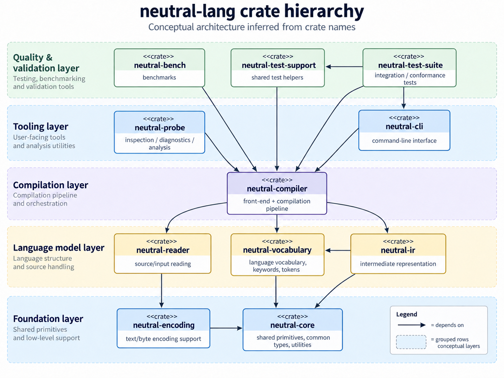
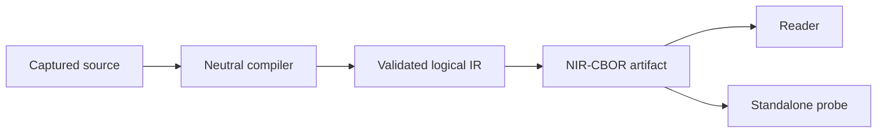

<!-- SPDX-License-Identifier: Apache-2.0 -->

<a href="https://github.com/neutral-ecosystem/neutral-lang"></a>

<div align="center">

  <p align="center">
    
    
    
    <a href="https://github.com/neutral-ecosystem/neutral-lang/releases"></a>
    <a href="LICENSE"></a>
    <a href="docs/README.md"></a>
  </p>

  <p>A portable declarative language for structured, platform-independent data and behavior.</p>

  <p align="center">
    <a href="#features">Features</a> •
    <a href="#showcase">Showcase</a> •
    <a href="#quick-start">Quick Start</a> •
    <a href="#development">Development</a> •
    <a href="#guides">Guides</a>
  </p>
</div>

---

## Features

- 🧱 Define scalar values, invariant lists, and nominal records with defaults.
- 🔗 Reuse immutable values and express typed identity references.
- 📚 Capture and validate closed vocabulary bundles without ambient lookup.
- 🧮 Preserve exact numbers in validated logical IR.
- 📦 Serialize artifacts with the versioned NIR-CBOR format.
- 🔍 Inspect encoded artifacts through `neutral-probe` without compiler linkage.
- 🛡️ Apply explicit structural limits, deterministic diagnostics, and cooperative cancellation.



## Showcase

Neutral is a compiler and artifact toolchain rather than a graphical runtime,
so the repository does not publish runtime screenshots. The canonical
[language showcase](conformance/releases/v0.1.0/specs/examples/LANGUAGE-SHOWCASE.md)
demonstrates the supported source features.

<details>
<summary><strong>View the Neutral source example</strong></summary>

```neu
neu "0.1"
module example

record Service {
    string image,
    List<string> labels = [],
}

Service api = {
    image: "example.invalid/api:1",
    labels: ["portable", "typed"],
}
```

</details>

## Quick start

Install the latest stable Rust toolchain with Rustfmt and Clippy. Linux is the
supported system-test host; Windows support is experimental.

Bootstrap the repository with the adapter for your host:

```sh
./scripts/linux/bootstrap.sh
```

```powershell
.\scripts\win\bootstrap.ps1
```

Compile the canonical minimal fixture and inspect its encoded artifact:

<details>
<summary><strong>View the compile and inspect commands</strong></summary>

```sh
cargo run --package neutral-cli -- compile --output target/minimal.nir conformance/releases/v0.1.0/specs/fixtures/positive/syntax/minimal-core.neu
cargo run --package neutral-probe -- target/minimal.nir
```

</details>

The bootstrap adapters verify prerequisites and record ignored environment
evidence. They do not install software, elevate privileges, modify shell
configuration, or define compiler, test, or release policy.

## Development

`cargo xtask` is the platform-neutral interface shared by local development,
CI, quality checks, documentation, packaging, and release preparation.

### Everyday workflow

| Need | Command |
| --- | --- |
| Verify the environment | `cargo xtask bootstrap` |
| Run the daily development loop | `cargo xtask dev` |
| Run the exact push CI gate | `cargo xtask ci pr` |
| Check formatting | `cargo xtask fmt` |
| Apply formatting | `cargo xtask fmt --write` |
| Run Clippy | `cargo xtask lint` |
| Run compile and repository checks | `cargo xtask check` |
| Build the development profile | `cargo xtask build --profile dev` |
| Generate the API website | `cargo xtask docs` |
| Remove generated evidence | `cargo xtask clean` |

### Test suites

| Test scope | Command |
| --- | --- |
| Run unit tests | `cargo xtask test unit` |
| Run smoke tests | `cargo xtask test smoke` |
| Run integration tests | `cargo xtask test integration` |
| Run system tests | `cargo xtask test system` |
| Run conformance tests | `cargo xtask test conformance` |
| Run property tests | `cargo xtask test property` |
| Run security tests | `cargo xtask test security` |
| Run every test suite | `cargo xtask test all` |
| Run performance tests | `cargo xtask test performance --profile pr\|release\|soak` |

### Quality and analysis

| Quality task | Command |
| --- | --- |
| Run the normal quality gate | `cargo xtask quality` |
| Run the release quality gate | `cargo xtask quality --profile release` |
| Show quality status | `cargo xtask quality status` |
| Render quality evidence | `cargo xtask quality render` |
| Verify quality evidence | `cargo xtask quality verify` |
| Evaluate retained quality | `cargo xtask quality evaluate --profile pr\|release` |
| Approve release quality | `cargo xtask quality approve --release <version>` |
| Measure coverage | `RUSTUP_TOOLCHAIN=nightly cargo xtask coverage` |
| Run a fuzz smoke test | `RUSTUP_TOOLCHAIN=nightly cargo xtask fuzz smoke` |
| Run full fuzz campaigns | `RUSTUP_TOOLCHAIN=nightly cargo xtask fuzz campaign` |

### Artifacts, versions, and releases

| Release task | Command |
| --- | --- |
| Validate an artifact | `cargo xtask validate <artifact>` |
| Validate repository binaries | `cargo xtask validate binaries` |
| Assemble a distribution | `cargo xtask package` |
| Prepare a release | `cargo xtask release prepare` |
| Build the release profile | `cargo xtask build --profile release` |
| Show the workspace version | `cargo xtask version show` |
| Check version consistency | `cargo xtask version check` |
| Prepare a new version | `cargo xtask version prepare <version>` |

### Portable plans and environment evidence

| Repository task | Command |
| --- | --- |
| Install a portable plan | `cargo xtask portable install <directory>` |
| Verify the portable plan | `cargo xtask portable verify` |
| Archive the portable plan | `cargo xtask portable snapshot` |
| Audit the workstation | `cargo xtask environment verify` |
| Print the environment manifest | `cargo xtask environment manifest` |

Generated API documentation remains local under `target/doc/` and is published
at the [Neutral API documentation website](https://neutral-lang-doc.younesrabeh.workers.dev/).
See the [development guide](docs/development.md) for the ordered workflow and
command ownership.

## Guides

Choose a guide by task, or browse the complete [documentation hub](docs/README.md):

| I want to… | Start here |
| --- | --- |
| Set up the repository and run checks | [Development workflow](docs/development.md) |
| Understand quality gates and analysis | [Quality and analysis](docs/quality-and-analysis.md) |
| Prepare a version or release | [Release and versioning](docs/release-and-versioning.md) |
| Understand directory and output ownership | [Repository structure](docs/repository-structure.md) |
| Resolve a common local failure | [Troubleshooting](docs/troubleshooting.md) |
| Browse crate APIs | [Live API documentation](https://neutral-lang-doc.younesrabeh.workers.dev/) |

## Tech stack

<p align="left">
  <a href="https://www.rust-lang.org/"></a>
  <a href="https://doc.rust-lang.org/edition-guide/rust-2024/"></a>
  <a href="https://github.com/features/actions"></a>
  <a href="https://www.rfc-editor.org/rfc/rfc8949"></a>
</p>

---

## License

Distributed under the [Apache License 2.0](LICENSE).
