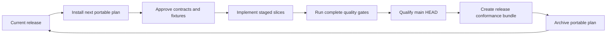

<!-- SPDX-License-Identifier: Apache-2.0 -->

# Development lifecycle

[< Back to Neutral](../README.md) • [Documentation Hub](README.md)

This guide defines how Neutral development advances from one released version
to the next. It connects the temporary `portable/` execution plan, contracts,
fixtures, implementation, tests, quality evidence, release qualification, and
final archival into one repeatable iteration.

## Lifecycle overview



The current release remains defined by its immutable directory under
`conformance/releases/`. An active `portable/` package describes future work;
it is never part of an already released language contract.

## Repository rules

| Rule | Required practice |
| --- | --- |
| One authoritative version | Derive package and release identity from `[workspace.package].version` in the root `Cargo.toml`. |
| One command surface | Use `cargo xtask`; scripts and CI remain thin adapters. |
| Latest stable development | Keep stable as the repository default. Use nightly only for tooling that requires it. |
| Main-head qualification | Perform release evaluation, approval, packaging, and tag qualification from the intended clean `main` `HEAD`. |
| Frozen behavior is immutable | Never edit a released contract, fixture, oracle, or conformance manifest to make a new implementation pass. |
| Future work stays portable | Keep proposed-version planning and unfinished contracts under the active `portable/` package. |
| No hidden host behavior | Source and vocabulary input must be captured explicitly; compiler logic must not depend on ambient files, network access, time, or process state. |
| Centralized constants | Reuse owning crate constants and configuration instead of duplicating commands, versions, diagnostic prefixes, or contract vocabulary. |
| Document every function | Add Rust documentation to public and private functions. |
| Stable output categories | Format user-visible automation and command output as `[category] message`, using the shared category constants. |
| Tests belong to owners | Put test bodies in the owning crate's `tests/` tree; production modules retain only path-based test declarations when needed. |
| Generated output is disposable | Keep Cargo, Rustdoc, analysis, benchmark, and workflow results under ignored `target/` or `test-results/` roots. |
| Evidence is reviewed | Do not convert raw generated output into an approval claim without recording its method, scope, result, and limitations. |

## 1. Close the current release baseline

Before starting the next version:

1. Confirm the released bundle exists under `conformance/releases/<version>/`.
2. Run `cargo xtask version check` and `cargo xtask ci pr` on the current tree.
3. Confirm the release's durable quality record is present under
   `quality/evidence/<version>/`.
4. Treat that bundle as immutable compatibility evidence while developing the
   next version.

Tests for a new version may add expectations, but they must not silently weaken
or rewrite the previous release's expected behavior.

## 2. Install the next portable plan

Obtain the reviewed next-version package from its planning repository, then run:

```sh
cargo xtask portable install <directory>
cargo xtask portable verify
```

Installation is atomic and refuses to overwrite an existing `portable/`
directory. Verification requires, at minimum:

```text
portable/
├── PLAN.md
├── lifecycle.toml
├── specs/
│   ├── REQUIREMENTS.md
│   ├── TRACEABILITY.md
│   ├── contracts/
│   │   ├── freeze.toml
│   │   ├── syntax.md
│   │   └── syntax-checklist.md
│   └── fixtures/
└── conformance/
    ├── manifest.toml
    └── oracles/
```

The package must identify an active numeric version series, contain no symbolic
links or special files, keep local links valid, and pass its recorded freeze
digests. A rejected installation is retained beneath `test-results/portable/`
for review rather than becoming the active plan.

## 3. Freeze contracts before implementation

Do not begin behavior-changing production work while a blocking normative
question remains. The contract-freeze gate should establish:

- accepted requirements and terminology;
- syntax, identity, vocabulary, IR, encoding, diagnostic, and limit contracts;
- a reviewed fixture/oracle manifest with immutable digests;
- explicit answers or dispositions for normative questions;
- traceability from each production task to its requirement and expected
  evidence.

`freeze.toml` is the machine-readable gate. Narrative documents explain the
decisions, while the manifest binds the exact reviewed inputs. When a frozen
contract must change, reopen the review and regenerate its recorded digest; do
not edit around the mismatch.

## 4. Execute one stage, step, and slice at a time

`portable/PLAN.md` is the active execution order. Work from the earliest
unfinished blocking item and keep each iteration small enough to review as one
coherent behavior change.

For each slice:

1. Read the linked requirement, decision, contract, fixture, oracle, and
   acceptance criteria.
2. Add or update positive and negative fixtures for the behavior being changed.
3. Add the smallest owning-crate test that expresses the contract.
4. Implement the production change within the documented crate boundary.
5. Add integration, system, conformance, property, security, or fuzz-regression
   coverage when the behavior crosses those boundaries.
6. Update traceability and user/developer documentation in the same change.
7. Run the focused test command, then `cargo xtask dev`.
8. Change the plan marker from `[ ]` to `[*]` only when implementation,
   documentation, fixtures, tests, and required evidence all pass.

Do not mark an item complete because code compiles or one happy-path fixture
passes. A slice is complete only when its failure behavior, limits, ownership,
and evidence are also resolved.

## 5. Design fixtures and oracles

Fixtures are executable contract examples, not convenient test data.

| Fixture class | Purpose |
| --- | --- |
| Positive | Prove accepted syntax and exact logical meaning. |
| Negative | Prove invalid, ambiguous, over-limit, or unsupported input fails with the expected classification. |
| Boundary | Exercise each structural limit exactly at the boundary and one unit over it. |
| Metamorphic | Prove non-semantic transformations preserve logical identity. |
| Hostile | Prove corrupt, truncated, oversized, duplicate, dangling, or unknown input fails boundedly. |

Organize fixtures by polarity and primary feature. Keep expected oracles outside
production code, register them in the conformance manifest, and bind the
reviewed manifest through the freeze record. Production code must never contain
fixture-specific branches.

When expected behavior changes intentionally, update the contract first, review
the affected fixture and oracle, update its digest, then change implementation.

## 6. Build the test pyramid with the feature

Choose the narrowest test level that proves each fact, then add broader levels
only for real boundaries.

| Level | Responsibility |
| --- | --- |
| Unit | Pure behavior owned by one crate. |
| Smoke | Released command shells start and expose their stable interface. |
| Integration | Public contracts compose correctly across crates. |
| System | Host, filesystem, process, binary, and failure-atomicity behavior. |
| Conformance | Source fixtures and external artifacts match frozen oracles. |
| Property/metamorphic | Invariants hold over many generated or transformed inputs. |
| Security | Limits, cancellation, malformed inputs, isolation, and fail-closed behavior. |
| Fuzz regression | Previously discovered malformed inputs remain bounded and non-panicking. |
| Performance | Controlled profiles detect time, memory, allocation, and growth regressions. |

Run focused tests while implementing:

```sh
cargo xtask test unit
cargo xtask test integration
cargo xtask test conformance
```

Before completing a slice, run:

```sh
cargo xtask dev
```

Before completing a stage, run:

```sh
cargo xtask test all
cargo xtask ci pr
```

The activated minimum counts and suite ownership live in
[`config/test-suites.toml`](../config/test-suites.toml) and
[`config/test-levels.toml`](../config/test-levels.toml). Tests must grow with
behavior; lowering a minimum to make a gate pass requires explicit policy
review.

## 7. Complete a stage

A stage closes only when:

- every required step and slice is marked `[*]`;
- its linked requirements have executable evidence;
- fixtures and oracles are registered and digest-consistent;
- focused, complete, and CI-equivalent tests pass;
- documentation and traceability describe the implemented state;
- no blocking normative or security question remains;
- generated evidence records the actual result without being manually edited.

Record the new stage and step only in the active tracking source designated by
the portable plan. Do not make production behavior depend on stage numbers;
normal commands use the durable current test profile.

## 8. Harden the completed version

After feature stages complete, run the full quality program appropriate to the
release. This includes deterministic repetition, adversarial concurrency,
coverage, mutation testing, fuzz campaigns, dependency review, threat modeling,
memory/allocation profiling, performance growth, stress, and soak testing where
required by policy.

```sh
cargo xtask quality --profile release
RUSTUP_TOOLCHAIN=nightly cargo xtask coverage
RUSTUP_TOOLCHAIN=nightly cargo xtask fuzz campaign
```

Raw reports remain under `test-results/`. Durable conclusions belong in the
quality review/evidence structure and must be registered according to the
[quality system](../quality/README.md).

## 9. Prepare and qualify the version

Choose the approved next SemVer and update repository metadata through the
version command:

```sh
cargo xtask version prepare <version>
cargo xtask version check
```

Commit the completed implementation and perform final qualification from a
clean `main` `HEAD`:

```sh
cargo xtask quality evaluate --profile release
cargo xtask quality approve --release <version>
cargo xtask release prepare
```

Release preparation validates the selected source state and assembles the
configured distribution. It does not push, tag, upload, or publish. Publication
remains an explicit tag-triggered repository operation after review.

## 10. Promote conformance and archive the iteration

Before removing the active plan:

1. Promote the accepted specifications, fixtures, oracles, and manifest into a
   new immutable `conformance/releases/<version>/` bundle.
2. Verify production and executable tests depend only on the released bundle,
   never on archived roadmap material.
3. Record the release's reviewed quality conclusions under
   `quality/evidence/<version>/`.
4. Create and verify a digest-addressed snapshot:

   ```sh
   cargo xtask portable verify
   cargo xtask portable snapshot
   ```

5. Review the generated snapshot and migration report under
   `test-results/portable/snapshot/`, then archive it in the designated external
   planning repository.
6. Remove `portable/` only after promotion and archival are confirmed.
7. Leave the repository in the documented awaiting-next-version state.

Conformance promotion and external archival are deliberate review actions; the
current automation verifies and snapshots their inputs but does not silently
publish them elsewhere.

## One complete iteration

A normal implementation iteration follows this loop:

```text
select one unchecked slice
→ read its frozen contract and expected evidence
→ add fixtures and failing tests
→ implement inside the owning crate
→ run focused tests
→ add cross-boundary and adversarial evidence
→ update documentation and traceability
→ run cargo xtask dev
→ mark [*]
→ run cargo xtask ci pr before pushing
```

If any step reveals an unresolved contract question, stop the implementation
loop, reopen the relevant decision and freeze review, and resume only after the
expected behavior is explicit again.

## Iteration completion checklist

- [ ] The change is linked to an accepted requirement.
- [ ] Positive, negative, and applicable boundary fixtures exist.
- [ ] Expected oracles are reviewed and registered.
- [ ] The owning crate contains focused tests.
- [ ] Cross-crate and host boundaries have the required broader tests.
- [ ] Structural limits, cancellation, and failure behavior are covered.
- [ ] Every new or changed function is documented.
- [ ] Shared names and values come from their owning constants or configuration.
- [ ] User-visible output follows `[category] message`.
- [ ] Documentation and traceability match the implementation.
- [ ] `cargo xtask dev` passes.
- [ ] `cargo xtask ci pr` passes before push.
- [ ] The plan item is changed to `[*]` only after all applicable checks pass.
